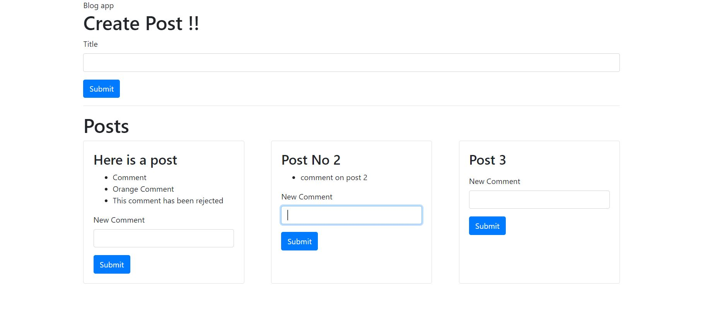

# Microservices Blog Mini App Using Node JS and React 

## Description 
#### This App is used to create new post and comments and has a feature to moderate the comments based on preferred string. 

### Tech Stack 
- Node js Express  :For creating Backend Services
- React            :For Client
- Docker           :Creating conatiners
- Kubernetes       :Running multiple container and networking  
- Skaffold         :Automating Build process 
- ingress nginx    :Load Balancer + ingress controller  (https://kubernetes.github.io/ingress-nginx/deploy/#quick-start)

List of Microservices Used:: 
- Post Service        : Create Post 
- Comment Service     : Create Comments on particular Post 
- Moderation Service  : State of Comment ( Pending , Removed , Approved) based on some string 
- EventBus            : Communication channel for all services 
- Query Service       : Query the post (To reduce the request from client)

## Usage 
This app is very basic form of app which helps in understanding microservice architecture . Implementing Basic Event Bus from scratch and interacting with all services.

